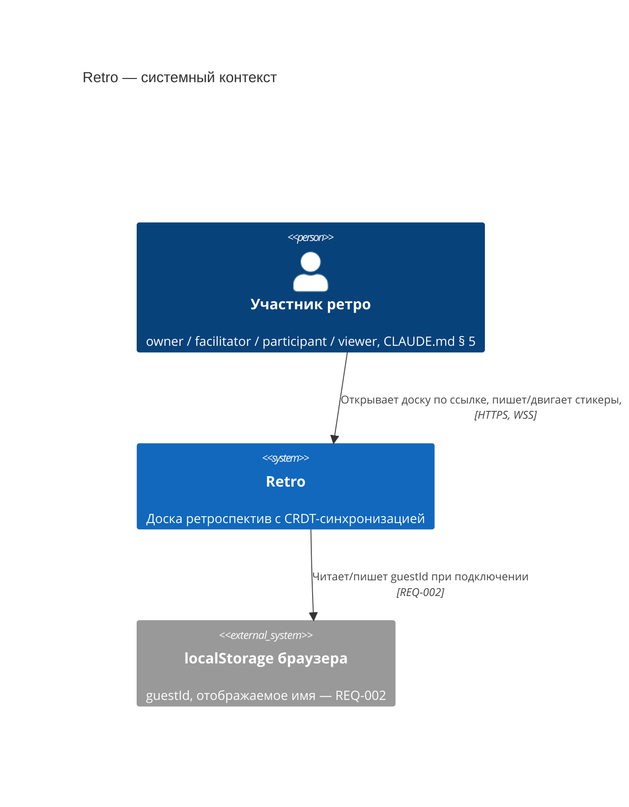
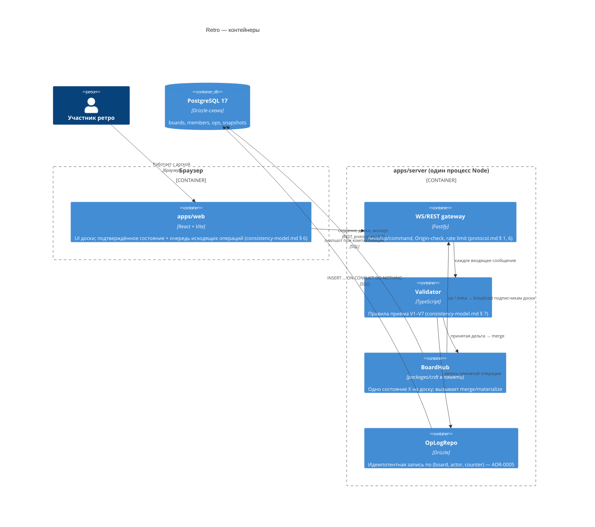

# Архитектура

- **Статус:** первая версия, 2026-09-13 (веха В3)
- **Источники:** `docs/spec/consistency-model.md` (модель согласованности), `docs/spec/protocol.md` (протокол), ADR-0001…0005
- **Уровень детализации:** C4 context + container. Компонентный уровень — в самом коде и в docs/spec/protocol.md (сообщения, правила приёма).

## Контекст (C4, уровень 1)

Кто и что взаимодействует с системой снаружи.

Вне контекста — интеграции с внешними системами (календарь, Slack и т.п.) сознательно отсутствуют: `docs/brief.md` § Что НЕ делаем.

## Контейнеры (C4, уровень 2)

**Почему один `BoardHub` на процесс, а не отдельный сервис на доску.** `packages/crdt` — чистые функции без сети; вся конкурентность одной доски обрабатывается последовательно в одном процессе (§ 7 `consistency-model.md`, предпосылка доказательств I1.2/I6). Горизонтальное масштабирование на несколько процессов — явно не в MVP (`docs/brief.md`, ADR-0005 § Последствия).

## Поток одной операции (пояснение к диаграмме контейнеров)

1. `web` применяет операцию локально (оптимистично), кладёт в очередь, отправляет `op` в `gateway`.
2. `gateway` проверяет форму (`packages/protocol`, zod) и `Origin`.
3. `validator` прогоняет V1–V7 по порядку (`protocol.md` § 5, таблица причин отказа) — актора и роль сервер берёт из своей сессии, не из сообщения (защита от подмены, `CLAUDE.md` § 5 «Модель угроз»).
4. При успехе: `oplog` пишет строку в `ops` (идемпотентно), `hub` делает `merge(state, delta)`, `gateway` отвечает `ack` автору и рассылает `op` остальным подписчикам доски в их проекции видимости.
5. При отказе — `reject` только автору, состояние `hub` не меняется.

## Соответствие модели согласованности

| Компонент | Роль в доказательстве |
|---|---|
| `packages/crdt` | Реализует `merge`, `materialize`, `compact` — предмет property-тестов (Т1, I1–I4) |
| `BoardHub` | Единственный держатель `X_S(n)` — предпосылка I1.2, I6 (последовательная обработка) |
| `OpLogRepo` + `snapshots` | `replay`/`compact` — предмет I5 |
| `web`: подтверждённое состояние + очередь | `X_c(u)` из § 6 — предпосылка I1.2 при переподключении (REQ-023) |

## Не входит в эту схему

- Внутреннее устройство React-компонентов `apps/web` — не архитектурный уровень, меняется чаще.
- CI/CD и деплой — `docs/ops/deploy.md` (появится на В6, вне вехи В3).
- Модель угроз и матрица прав как отдельные диаграммы — `docs/security/` (В5); здесь только упоминается, где проходит граница доверия (сервер не доверяет `actorId`/`lamport` от клиента).
