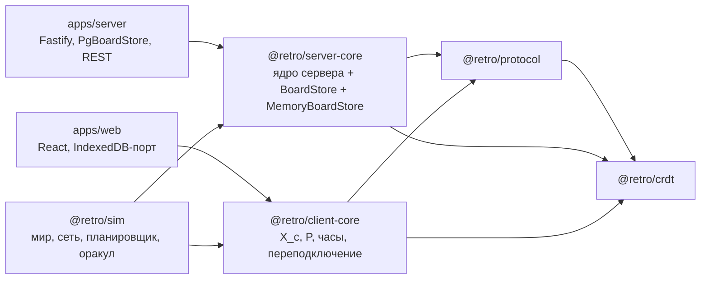

# Проектирование T-005: детерминированный симулятор

- **Статус:** проект, 2026-09-15
- **Что:** `docs/spec/simulator.md` (SIM-01…SIM-12, S1–S11). **Почему так:** ADR-0009.
- **Этот документ:** как устроено — пакеты, интерфейсы, алгоритмы, порядок работ. Имена в листингах — целевые, их фиксирует контракт-коммит каждой задачи.

---

## 1. Решение в пяти строках

1. Логика `ws/gateway.ts` переезжает в `packages/server-core` (`createBoardServer`), хранилище — порт `BoardStore` с адаптерами Postgres и в памяти.
2. **Работа начинается с ядра клиента** — пакет `packages/client-core` (T-028): состояние клиента + методы работы с доской, без браузера и UI. Браузерные адаптеры — T-014.
3. `packages/sim` собирает мир: одно ядро сервера, N ядер клиентов, `MemoryBoardStore`, модель каналов, планировщик на seeded-генераторе.
4. Проверки S1–S11 считают ожидаемое оракулом из спецификации, а не из проверяемого кода.
5. Непустота доказывается покрытием сценариев и мутантами на границах. Воспроизведение — трасса решений + ddmin.

---

## 2. Пакеты и зависимости



Запрещено (правило Biome `noRestrictedImports` + `tsconfig` references): `packages/*` → `apps/*`; `sim` → `…/src/…` чужих пакетов; `server-core`/`client-core`/`sim` → `node:*` (кроме `node:crypto` в адаптере `voterToken` у `apps/server` и `node:fs`/`node:util` в `sim/src/cli.ts`).

---

## 3. `packages/server-core` (задача T-024, хранилище в памяти — T-025)

### 3.1 Публичный API

```ts
export type ConnectionId = string;

export interface Outgoing {
  readonly to: ConnectionId;
  /** Уже сериализовано: ровно та строка, что уйдёт в сокет. */
  readonly raw: string;
}

export interface ReceiveResult {
  readonly outgoing: readonly Outgoing[];
  /** Соединения, которые надо закрыть ПОСЛЕ отправки `outgoing` (error/invalid_shape). */
  readonly close: readonly ConnectionId[];
}

export interface ServerCorePorts {
  readonly store: BoardStore;
  /** HMAC(секрет, boardId + guestId) — секрет знает только адаптер. */
  readonly voterToken: (boardId: string, guestId: string) => string;
  /** Необязательный лог внутренних ошибок; в симуляторе — счётчик. */
  readonly onInternalError?: (error: unknown, context: { boardId: string; connection: ConnectionId }) => void;
}

export interface BoardServer {
  /** Соединение открыто для доски; сообщений ещё не было. Синхронно. */
  open(connection: ConnectionId, boardId: string): void;
  /**
   * Ставит обработку в очередь доски СИНХРОННО в момент вызова (до первого await) —
   * отсюда порядок: сообщения одного соединения обрабатываются в порядке вызова
   * (SIM-05 кр. 2, H2). Промис разрешается, когда обработка закончена.
   */
  receive(connection: ConnectionId, raw: string): Promise<ReceiveResult>;
  /** Отписка тоже через очередь: рассылка, начатая до close, ещё видит подписчика. */
  close(connection: ConnectionId): Promise<void>;
}

export function createBoardServer(ports: ServerCorePorts): BoardServer;

// Чистые правила — переезжают из apps/server/src/ops/*, там остаются реэкспорты.
export { validateOp, MAX_LAMPORT_AHEAD } from "./rules/validate.js";
export { classifyAction, checkPermission } from "./rules/permissions.js";
export { checkVotePermission, checkVoteLimit, checkVoteOwnership } from "./rules/votes.js";
export { projectVisible, projectHidden, isEmptyDelta } from "./rules/visibility.js";
export { resolveRole, checkSetPhase, checkResetVotes } from "./rules/board.js";
export { createMemoryBoardStore, type MemoryBoardStore } from "./memory-store.js";
export type * from "./store.js";
```

### 3.2 Порт `BoardStore` — только хранение

```ts
export interface BoardRecord {
  readonly id: string;
  readonly title: string;
  readonly ownerId: string;
  readonly phase: Phase;
  readonly voteLimit: number;
  /** T-026 (ВС-2 б): последний seq доски в момент первого ухода из collect; null — ещё collect. */
  readonly revealSeq: number | null;
}

export interface BoardStore {
  /** null — нет доски или она удалена. */
  board(boardId: string): Promise<BoardRecord | null>;
  memberRole(boardId: string, guestId: string): Promise<Role | null>;
  updatePhase(boardId: string, phase: Phase, revealSeq: number | null): Promise<void>;

  findOpSeq(boardId: string, dot: Dot): Promise<number | null>;
  findUnvoteSeq(boardId: string, voteDot: Dot, target: EntityId): Promise<number | null>;
  actorClock(boardId: string, actor: ActorId): Promise<ActorClock>;
  opsSince(boardId: string, sinceSeq: number): Promise<OpRow[]>;
  /** T-026 (H1): операции со seq <= uptoSeq — досылка гостю при reveal-переподключении. */
  opsUpTo(boardId: string, uptoSeq: number): Promise<OpRow[]>;
  /** Последний seq доски (0, если журнал пуст) — для revealSeq. */
  lastSeq(boardId: string): Promise<number>;
  latestSnapshot(boardId: string): Promise<SnapshotRecord | null>;
  /** ≈ replay(журнал): равенство после materialize (I5); адаптер вправе кэшировать. */
  currentState(boardId: string): Promise<ReplayResult>;

  authors(boardId: string): Promise<ReadonlyMap<EntityId, string>>;
  authorDisplayNames(boardId: string): Promise<Record<EntityId, string>>;

  /** Всё внутри fn фиксируется целиком или не фиксируется вовсе. */
  transaction<T>(fn: (tx: BoardStoreTx) => Promise<T>): Promise<T>;
}

export interface BoardStoreTx {
  appendOp(params: AppendOpParams): Promise<{ readonly seq: number }>;
  recordAuthor(boardId: string, entityId: EntityId, guestId: string): Promise<void>;
}
```

`ActorClock`, `OpRow`, `AppendOpParams`, `ReplayResult`, `SnapshotRecord` переезжают из `apps/server/src/ops/log.ts` в `server-core/src/store.ts` (в `log.ts` — `export type` реэкспорт).

**Уточнение (2026-09-15, T-024, при реализации):** функции-тела `ops/log.ts`, `ops/authors.ts` и `boards/service.ts` (доступ к Postgres) **остаются на месте**, а не переезжают в `server-core/src/pg-store.ts` буквально — `apps/server/test/oplog.int.test.ts` и `boards.int.test.ts` импортируют их напрямую по сигнатуре `(db, …)`, и критерий готовности T-024 требует «все существующие `test:int` зелёные без правки». `PgBoardStore` — тонкая обёртка (`class PgBoardStore implements BoardStore`), делегирующая этим функциям; типы (`ActorClock`, `OpRow`, …) всё равно переезжают в `store.ts`, в `ops/log.ts` — реэкспорт. В `server-core` целиком переезжают только чистые модули без I/O: `validate.ts`, `permissions.ts`, `votes.ts`, `visibility.ts`, `board-queue.ts` (→ `queue.ts`).

### 3.3 Устройство ядра

```text
server-core/src/
  index.ts
  board-server.ts     createBoardServer: реестр соединений, очередь, разбор, диспетчер, catch → error+close
  queue.ts            бывший ws/board-queue.ts (без изменений поведения)
  subscribers.ts      бывший BoardHub без сокета: ConnectionId → {boardId, actorId, guestId, role, welcomed}
  handlers/hello.ts   роль (resolveRole), welcome: снапшот/хвост/проекция, досылка H1 после T-026
  handlers/op.ts      идемпотентность → validateOp → V6 → V7 → transaction(appendOp, recordAuthor) → ack → рассылка
  handlers/command.ts setPhase (+ досылка reveal), resetVotes
  rules/*.ts          чистые правила (перенос)
  store.ts            порт
  memory-store.ts     MemoryBoardStore
test/
  store-contract.ts   describeBoardStoreContract(name, makeStore) — общий набор (SIM-03)
  memory-store.test.ts
  board-server.test.ts ядро на MemoryBoardStore: порядок hello→op (H2), close в очереди, error+close
```

**Уточнение (2026-09-15, T-024):** `MemoryBoardStore` появляется только в T-025, а `board-server.test.ts` (SIM-05, порядок `hello`/`op`/`reveal`) нужен уже в T-024 — критерий готовности требует «каждое сообщение и отписка идут через очередь доски» проверенным здесь, не отложенным. Тест-автор пишет его на маленьком управляемом stub-хранилище (управляемые промисы `board()`/`lastSeq()`, без CRDT-состояния — только то, что нужно `hello`/`op`/`command` для маршрутизации), не на `MemoryBoardStore`. Тем же файлом проверяется гонка **находки 1 code-review PR #19** (T-026), которая осталась без red-теста именно потому, что требовала реального переплетения двух I/O — здесь, на синхронном ядре, оба порядка (`hello` до/после `reveal` другого соединения) воспроизводятся детерминированно.

Handlers — это перенос тел веток `gateway.ts` почти построчно: `send(socket, m)` превращается в `out.push({to, raw: JSON.stringify(m)})`, `deps.db` — в `store`, `boardsService.*` — в `store.board/memberRole` + `rules/board.ts`. Порядок проверок и тексты `reason` не меняются.

`apps/server` после T-024:

```text
apps/server/src/
  ws/gateway.ts       ~40 строк: socket.on("message", raw => server.receive(id, raw).then(flush)); close → server.close(id)
  store/pg-store.ts   PgBoardStore: тела из ops/log.ts, ops/authors.ts, выборки boards/service.ts
  ops/*.ts            реэкспорты из @retro/server-core (для существующих тестов)
apps/server/test/
  pg-store.int.test.ts  describeBoardStoreContract("pg", () => new PgBoardStore(db))
```

Отправка в gateway — строго в порядке разрешения промисов `receive`. Так как очередь последовательна, этот порядок совпадает с порядком обработки.

### 3.4 `MemoryBoardStore`

```ts
export interface MemoryBoardStore extends BoardStore {
  // Настройка мира (не часть порта — REST в симуляторе не моделируется).
  createBoard(input: { id: string; title: string; ownerId: string; ownerName: string; voteLimit: number }): void;
  addMember(boardId: string, guestId: string, role: Role, displayName: string): void;
  saveSnapshot(boardId: string): void;                  // compact(currentState) на lastSeq
  // Неисправности и наблюдение — только для симулятора и тестов.
  failNextTransaction(afterWrites: number): void;       // E9: бросить после k-й записи
  log(boardId: string): readonly OpRow[];               // для оракула: сырые строки журнала
}

export function createMemoryBoardStore(options?: { seqGap?: () => number }): MemoryBoardStore;
```

- Журнал — массив строк, индексы `(actor,counter) → seq` и `"dot|target" → seq` для `unvote` (первое вхождение), `actorClock` — поддерживаемые максимумы. `seq` монотонен на всё хранилище (не на доску) — как общий `bigserial` в Postgres, поэтому `opsSince`/`opsUpTo` можно делать бинарным поиском по массиву строк доски.
- `authorOf`/`recordAuthor` — первый писатель побеждает (`onConflictDoNothing` в Postgres); `authorDisplayNames` не включает авторов без записи в участниках (`inner join`).

**Уточнение (2026-09-16, T-025, при реализации):**

1. **`currentState` повторяет форму `PgBoardStore`, не «инкрементальный merge всех строк с начала».** `replayFromSnapshot` в Postgres — это `compact(снапшот) ⊔ хвост после него`; после `saveSnapshot`/E8 состояние в кэше должно быть СЖАТЫМ, иначе правила приёма в памяти и на Postgres расходятся именно в той точке (после снапшота), где различие важнее всего — а симулятор его никогда не увидит. `saveSnapshot(boardId)` сбрасывает кэш в `compact(currentState)` на текущем `lastSeq`; `appendOp` дальше `merge`-ит хвост поверх этого кэша, как и раньше.
2. **`failNextTransaction(afterWrites)` (E9), точная семантика:** бросает `(afterWrites + 1)`-я запись `tx.appendOp`/`tx.recordAuthor`внутри одной транзакции; если их оказалось меньше (например, `op` над группой делает только `recordAuthor`), транзакция бросает при попытке зафиксироваться, не применив ни одной записи буфера. Неисправность одноразовая: следующая успешно завершившаяся (или снова упавшая по повторному вызову) транзакция её снимает. `seq`, выданные строкам упавшей транзакции, считаются израсходованными (не переиспользуются) — как `nextval` у `bigserial`, который тоже не откатывается.
3. **Три расхождения с Postgres добавляются в `store-contract.ts` (SIM-03 кр. 2, «новый метод порта — сначала в набор»), а не только в `memory-store.test.ts`:** first-writer-wins у `recordAuthor`; `authorDisplayNames` без участника; неизменяемость хранилища при мутации возвращённых выборок. Заодно сигнатура `BoardStoreContractSetup.saveSnapshot` упрощается до `(store, boardId) => Promise<void>` («снапшот текущего состояния доски на её `lastSeq`», без произвольного `SnapshotRecord`-аргумента) — так она совпадает с тем, что реально делает E8, а не с придуманным для смока T-024 интерфейсом; `pg-store.int.test.ts` и `store-contract.smoke.test.ts` подстраиваются под новую сигнатуру.
4. Опечатка в § 6 («заводится задача T-028» для будущего накопителя в `crdt`) исправлена — номер уже занят `client-core`, новая задача пока без номера (заводится при необходимости, спецификация в § 6 не меняется).

---

## 4. `packages/client-core` — контракт ядра клиента (задача T-028, первый шаг)

`client-core` — состояние одного клиента (одной вкладки) плюс методы работы с доской. Никакого UI и транспорта: на вход — действия пользователя и строки от сервера, на выход — строки к серверу и снимок состояния. Браузер (T-014) и симулятор (T-005) — две обёртки над одним и тем же ядром.

```ts
export type Intent =
  | { type: "createSticker"; column: Column; frac: string; text: string; color: Color }
  | { type: "editText"; id: EntityId; text: string }
  | { type: "setColor"; id: EntityId; color: Color }
  | { type: "move"; id: EntityId; place: Place }
  | { type: "setGroup"; id: EntityId; group: EntityId | null }
  | { type: "delete" | "restore"; id: EntityId }
  | { type: "createGroup"; column: Column; frac: string; title: string }
  | { type: "renameGroup"; id: EntityId; title: string }
  | { type: "createAction"; text: string }
  | { type: "editAction"; id: EntityId; text: string }
  | { type: "assign"; id: EntityId; guestId: string | null }
  | { type: "setDone"; id: EntityId; done: boolean }
  | { type: "vote"; target: EntityId }
  | { type: "unvote"; voteDot: Dot; target: EntityId };

export interface ClientCorePorts {
  /** Новый actorId (UUID) — браузер: crypto.randomUUID; симулятор: генератор. */
  readonly newActorId: () => string;
  /** Новый id команды — аналогично. */
  readonly newCommandId: () => string;
  /** Персистентность очереди (ВС-1). Браузер — IndexedDB, симулятор — в памяти мира. */
  readonly outbox: OutboxStore;
}

export interface SyncClient {
  /** Транспорт открыт → [hello]. Очередь НЕ отправляется до welcome (H2). */
  connected(): string[];
  /** Строка от сервера → строки к серверу (после welcome — вся P по порядку). */
  receive(raw: string): string[];
  /** Транспорт закрыт; P сохраняется. */
  disconnected(): void;
  /** Локальное действие: оптимистично в P; если welcomed — [op], иначе []. */
  act(intent: Intent): { ok: true; send: string[] } | { ok: false; reason: "queue_full" | "not_welcomed_yet" | "invalid_intent" };
  command(command: Command): string[];
  /** Снимок для экрана и для проверок симулятора (неизменяемые данные). */
  inspect(): ClientSnapshot;
}

export interface ClientSnapshot {
  readonly actorId: ActorId;
  readonly confirmed: State;                                   // X_c
  readonly pending: readonly { readonly delta: WireDelta; readonly dot: Dot; readonly kind: "op" | "unvote" }[]; // P
  readonly view: View;                                         // materialize(X_c ⊔ ⨆P)
  readonly lastSeq: number | null;
  readonly status: "offline" | "connecting" | "welcomed";
  readonly role: Role | null;
  readonly meta: BoardMeta | null;
  readonly voterToken: string | null;
  readonly rejections: readonly { readonly dot: Dot; readonly reason: RejectReason }[];
}

export function createSyncClient(
  config: { boardId: string; guestId: string; displayName: string },
  ports: ClientCorePorts,
): SyncClient;
```

Обязательные правила поведения (из `consistency-model.md` § 6 и находок H2/H3/H5):

| Сообщение | Действие |
|---|---|
| `welcome` | `X_c := X_c ⊔ snapshot ⊔ ops`, `lastSeq := max(lastSeq, upToSeq, seq…)`, `status := welcomed`, вернуть `op` для **всех** `P` в порядке добавления |
| `op` (в т.ч. пришедший раньше `welcome`) | `X_c := X_c ⊔ delta`, `lastSeq := max` — никогда не отбрасывается |
| `ack {dot, seq}` | первая в порядке добавления дельта `P` с этим dot: в `X_c`, из `P`. Нет такой — игнор (повторный ack) |
| `reject {dot, reason}` | первая дельта `P` с этим dot: удалить, записать в `rejections`. Остальные `P` не трогать (REQ-024) |
| `error` | `status := offline` (сервер закроет соединение) |
| `act` при `|P| ≥ Kc` (ВС-3) | `{ok:false, reason:"queue_full"}` |

Часы: `tick` берёт `max(clock.lamport, maxLamport(view state))`, как в `packages/crdt`. Состояние вида `X_c ⊔ ⨆P` кэшируется и пересчитывается только при изменении `P` или `X_c`.

---

## 5. `packages/sim` (задача T-005)

### 5.1 Модули

```text
packages/sim/src/
  cli.ts          parseArgs (node:util), запуск run/replay/minimize, печать, запись трассы, exit code
  config.ts       SimConfig, профили § 5.3, валидация аргументов
  prng.ts         splitmix32(seed) → sfc32; next(), int(a,b), pick(weights), uuid(), word()
  world.ts        createWorld(config, prng): доска, гости, роли, клиенты, MemoryBoardStore, BoardServer
  network.ts      Connection {id, client, toServer: string[], toClient: string[], alive, noticePending}
  events.ts       Event (сериализуемый union), enabledEvents(world, mode) — фиксированный порядок
  intents.ts      generateIntent(world, client, prng): Intent | null — по видимому экрану и матрице прав
  apply.ts        applyEvent(world, event): Promise<StepObservation> — единственное место, где мир меняется
  oracle.ts       authorship (истинное), phaseLog, projFor(guestId, X_S), foldLog(rows) → X_S
  well-formed.ts  W1–W4: инкрементально по строке журнала + полная проверка
  checks.ts       S1–S11: (world, observation) → Violation | null
  drain.ts        процедура § 7 и граница B
  stats.ts        счётчики сводки и покрытия SIM-11
  trace.ts        Trace {version, seed, config, decisions}, сериализация, sha256 (для SIM-02 — чистая реализация или node:crypto только в cli/test)
  run.ts          runSimulation(config) / replayTrace(trace) → RunResult
  minimize.ts     ddmin(decisions, failsWith(id))
  mutants.ts      обёртки M1–M7 (экспортируются только через "./testing")
packages/sim/test/
  sim.test.ts          SIM-09 × S1–S11 × REQ-022/023/024/025/006/027: профили × seed (§ 11.2)
  determinism.test.ts  SIM-02 (два прогона, сравнение хэшей; сканер запрещённых API)
  coverage.test.ts     SIM-04, SIM-11
  mutants.test.ts      SIM-08, SIM-12
  regressions.test.ts  SIM-10 кр. 3: все трассы из test/regressions/*.json зелёные
  purity.test.ts       SIM-01: сканер импортов
```

### 5.2 Главный цикл

```ts
async function runSimulation(config: SimConfig): Promise<RunResult> {
  const prng = createPrng(config.seed);
  const world = createWorld(config, prng);
  const decisions: Event[] = [];
  let nextCheckpoint = prng.int(config.checkpointMin, config.checkpointMax);

  while (world.acts < config.ops) {
    const event = chooseEvent(enabledEvents(world, "run"), config.profile.weights, prng, world);
    decisions.push(event);
    const violation = await step(world, event);           // applyEvent + пошаговые проверки S1–S3, S7, S10, S11
    if (violation) return fail(violation, decisions);
    if (world.acts >= nextCheckpoint) {
      const v = await checkpoint(world, prng, decisions);  // drain (S9) + S4, S5, S6, S8, полный S1
      if (v) return fail(v, decisions);
      nextCheckpoint = world.acts + prng.int(config.checkpointMin, config.checkpointMax);
    }
  }
  const v = await checkpoint(world, prng, decisions);
  return v ? fail(v, decisions) : ok(world.stats, decisions);
}
```

- `step` — единственный `await` на шаг. Внутри ядра нет таймеров и реального I/O, поэтому все промисы разрешаются микрозадачами до возврата, и порядок детерминирован.
- Решения досылки тоже пишутся в `decisions`: трасса полная, `replay` не использует генератор вообще.
- `replayTrace` — тот же цикл, но события берутся из трассы. Неприменимое событие (`isApplicable(world, event) === false`) пропускается и считается.

### 5.3 Применение событий

| Событие | `applyEvent` |
|---|---|
| `act` | `client.act(intent)` → строки в `conn.toServer` (если есть живое соединение); запомнить `dot → {client, intent}` для S6/S7 |
| `deliver toServer` | `raw = conn.toServer.shift()`; S11 (схема, 16 KiB); `res = await server.receive(conn.id, raw)`; каждый `Outgoing` — в `toClient` своего соединения, **если оно живо** (иначе счётчик «потеряно после разрыва»); `res.close` → как `cut` без отложенного E4 |
| `deliver toClient` | `raw = conn.toClient.shift()`; S11, S10; `ack` → S3; `reject`/`error` → S7; `client.receive(raw)` → строки в `toServer` |
| `cut` | `alive = false`, каналы очищаются, `client.disconnected()`, `noticePending = true` |
| `serverNotice` | `await server.close(conn.id)`, `noticePending = false` |
| `connect` | новое `Connection`, `server.open(id, boardId)`, `client.connected()` → `toServer` |
| `reload` | `cut` (если было соединение) → новый `createSyncClient` с тем же гостем и тем же `OutboxStore` мира (ВС-1 б); до решения ВС-1 событие разрешено только при `P = ∅` |
| `command` | `client.command(cmd)` → `toServer`; ожидаемый `setPhase` фиксируется в оракуле **по `commandResult ok`**, пришедшему клиенту, или по `store.board().phase` после шага, если ответ потерян (фаза — факт хранилища, не логика) |
| `snapshot` | `store.saveSnapshot(boardId)`; запомнить `upToSeq` для S8 |
| `storeFault` | `store.failNextTransaction(prng.int(0, 1))`; следующий `error` разрешён S7 |

После каждого `deliver toServer` оракул читает `store.log(boardId)` с последнего известного индекса. Новые строки проходят `wellFormed.addRow` (S1 инкрементально), обновляют `X_S := merge(X_S, fromWire(row.delta))` и затем S2.

### 5.4 Оракул

```ts
interface Oracle {
  /** entityId → guestId: пишется в apply(act createSticker) по dot, который вернул client.act. */
  readonly stickerAuthor: Map<EntityId, string>;
  phaseAt(): Phase;                    // по store.board().phase — после каждого шага
  xs(): State;                         // свёртка журнала (не currentState)
  proj(guestId: string, state: State): State;   // § 5 consistency-model.md, REQ-006 — своя реализация, без projectVisible
  visibleSame(a: string, b: string): boolean;   // proj_a(X_S) equals proj_b(X_S)
}
```

`proj` реализуется заново по спецификации: фильтр пяти компонент `State` по предикату «фаза ≠ collect ∨ kind(id) ≠ sticker ∨ stickerAuthor(id) = guestId». Для `supersedes`/`entries` без записи в `C` вид берётся из журнала (сущность могла быть создана, но её `created` скрыт от получателя — тогда вид всё равно `sticker`). Намеренно не импортируется `projectVisible`: оракул не должен разделять ошибку с проверяемым кодом (SIM-01 кр. 2).

### 5.5 Проверки

| ID | Реализация |
|---|---|
| S1 | `wellFormed.addRow(row)`: индекс `cell|dot → canonical(value)` (W1), `lamport|actor → dotKey` (W2), для каждого `supersede` в строке — есть запись этой же строки в ту же ячейку, и `lamport` записи-цели (если известна) меньше (W3), для `created` — записи во всех полях вида с dot = id в этой же строке (W4). Полная проверка в контрольной точке — тот же проход по всему журналу с нуля: сравнивает, что инкрементальный и полный результаты совпадают |
| S2 | `activeVotes(X_S)` сгруппировать по `user`, ≤ `voteLimit` |
| S3 | `row = store.log().find(seq)`; для `op`-пендинга — `operationDot(row.delta)` равен; для `unvote` — пара в `row.delta.unvotes`; глобально — индекс `(actor,counter)` без повторов |
| S4 | `equals(client.inspect().confirmed, oracle.proj(guest, X_S))`; при неравенстве — diff пяти компонент (первые 5 элементов с каждой стороны) |
| S5 | группировка клиентов по `proj`; внутри группы `canonical(materialize)` равны; если фаза ≠ collect — все равны `canonical(materialize(X_S))` |
| S6 | для каждого `dot` из множества «получен ack» — присутствует в `X_S` |
| S7 | причина ∈ разрешённого множества; dot отсутствует в журнале; в покое — отсутствует в `confirmed` и `pending` автора |
| S8 | для каждого снапшота: `materialize(merge(snapshot.state, fold(opsSince(upToSeq))))` и `materialize(currentState)` против `materialize(X_S)` |
| S9 | `drain` возвращает `Violation` при превышении `B` или пустых каналах с непустым `P` |
| S10 | пока `oracle.phaseAt() === "collect"`: разобранный `op`/`welcome` — ни один элемент не касается стикера с `stickerAuthor ≠ guest получателя` |
| S11 | `clientMessageSchema.safeParse` / `serverMessageSchema.safeParse`; `raw.length` (в байтах UTF-8) ≤ 16 KiB только к серверу; максимум по направлениям — в `stats` |

Сравнение `materialize` — через каноническую сериализацию (ключи отсортированы), как `canonical` в `packages/crdt` (не импортируется: внутренняя функция; в `sim` своя на 10 строк).

### 5.6 Генератор намерений

```text
generateIntent(world, client, prng):
  s = client.inspect(); if s.status === "offline" && prng < offlineActRate → действуем офлайн, иначе тоже можно
  role = роль гостя; phase = s.meta?.phase ?? "collect"; if role === viewer → null
  candidates = разрешённые матрицей (role, phase) виды намерений, у которых есть цель на экране s.view
    свои стикеры = oracle.stickerAuthor по guest (истинное знание, § 5.2 спецификации)
    свои голоса = activeVotes(merge(confirmed, pending)) с user = s.voterToken
  kind = prng.pick(веса профиля ∩ candidates)
  target = prng < hot ? из world.recent (последние 3 сущности, ∩ видимые) : prng.pick(видимые подходящие)
  значения: WORDS (8), FRAC_ALPHABET = "abc" длиной 1–2, домены цвета/колонки
```

Веса намерений по фазам (профиль `default`):

| Фаза | Основные намерения |
|---|---|
| `collect` | createSticker 40, editText 25, setColor 10, move 10, delete/restore 5, createGroup 10 (owner/facilitator) |
| `group` | move 25, setGroup 20, createGroup 10, renameGroup 10, editText 15, createSticker 10, delete/restore 10 |
| `vote` | vote 60, unvote 30, остальное 10 (owner/facilitator) |
| `discuss`, `actions` | createAction 30, editAction 20, assign 20, setDone 20, delete 10 |

События мира (профиль `default`, относительные веса): `act 30`, `deliver 55`, `cut 2`, `serverNotice 3`, `connect 4`, `reload 0.5`, `command 1`, `snapshot 0.3`, `storeFault 0` (в `faults` — 0.3). Команды: `setPhase` по сценарию профиля (§ 3 спецификации), `resetVotes` — в фазе `vote` с долей 10 % от `command`.

### 5.7 Генератор случайных чисел

`sfc32`, состояние — четыре `uint32`, инициализация: `splitmix32(seed)` четырежды, затем 15 холостых шагов. `seed` — целое `0 … 2³²−1` (CLI отвергает иное). `uuid()` — 122 случайных бита с установленными битами версии 4 и варианта. Выбор по весам — один `next()` на решение, веса суммируются в фиксированном порядке `enabledEvents`. Любое изменение этого пункта — `trace.version + 1`.

### 5.8 Минимизация

`ddmin` по `decisions` с оракулом «`replayTrace` падает на том же ID». Разбиения n = 2, 4, …; сначала пробуются дополнения. После 1-минимальности — проход «удалить по одному». Число повторов ограничено (`--minimize-budget`, по умолчанию 2000 прогонов). Для трасс из 10⁴ решений сначала выполняется **обрезка хвоста**: всё после шага нарушения отбрасывается.

---

## 6. Производительность

| Источник | Оценка при n = 10⁴ операций, c = 5 клиентов | Мера |
|---|---|---|
| `merge` копирует `Map` целиком (`union` → `new Map(a)`) | ~(c + 2) реплик × Σ|X| ≈ 7 · 3·10⁴ · 10⁴ / 2 ≈ 10⁹ копирований элементов — десятки секунд и более | в `check` — `--ops=1500` (≈ 45× меньше); `sim:long` — вне `check` |
| `currentState` на каждом `op` | `MemoryBoardStore` — O(1) (кэш) | Postgres — H6, отдельно |
| Кэш вида клиента `X_c ⊔ ⨆P` | пересчёт только при изменении | — |
| Полный S1 | только в контрольных точках | — |

Первый шаг T-005 — замер на `--ops=1500` и `--ops=10000`. Если `sim:long` > 10 мин, заводится отдельная задача (номер — при заведении, T-028 уже занят `client-core`): в `packages/crdt` — чистый `accumulate(deltas)`/накопитель с внутренним изменяемым `Map` и property-тестом `accumulate(ds) equals fold(merge)`. Решение — через скилл `crdt-op`, не в T-005.

---

## 7. Изменения в спецификациях и коде по задачам

### 7.1 Новые и изменённые задачи

| Задача | Суть | Зависит от | REQ | Размер |
|---|---|---|---|---|
| **T-026** | H1: красный `ws.int.test.ts` (переподключение после `reveal`), затем исправление по ВС-2 (б): `boards.reveal_seq`, миграция, `welcome` досылает `projectHidden` строк `≤ min(lastSeq, revealSeq)`. H2: красный интеграционный тест `hello`+`op` подряд, затем исправление — сообщения одного соединения сериализуются (минимальная заплатка; правило 2 `CLAUDE.md` не даёт смёржить постоянно красный тест) | T-013 | REQ-006, REQ-023 | S |
| **T-024** | `packages/server-core`: перенос правил и хендлеров, порт `BoardStore`, `PgBoardStore`, тонкий gateway, контрактный набор на Postgres. Поведение не меняется (H1/H2 уже исправлены в T-026; здесь временная заплатка H2 заменяется архитектурной гарантией SIM-05, все `test:int` зелёные без правки) | T-013, T-026 | infra | M |
| **T-025** | `MemoryBoardStore` + тот же контрактный набор в `test:unit` + тесты ядра на нём (`board-server.test.ts`) | T-024 | infra | S |
| **T-028** | **первый шаг:** ядро клиента `packages/client-core` по контракту § 4; порт хранилища очереди с реализацией в памяти | T-009 | REQ-023, REQ-024 | M |
| **T-014** (сужена) | `apps/web`: адаптеры WebSocket и IndexedDB над `client-core`, ADR по ВС-1 | T-028 | REQ-002 | M |
| **T-005** | `packages/sim` § 5 без минимизации: мир, сеть, планировщик, генератор, оракул, S1–S11, досылка, CLI, `test:sim` в `check`, покрытие SIM-11 | T-028, T-025 | REQ-022, REQ-023, REQ-024, REQ-025 | M |
| **T-027** | трасса/`--replay`/`--minimize`, мутанты M1–M7 (SIM-12), регрессионные трассы, скилл `debug-convergence` | T-005 | infra | S |

Порядок PR (решение 2026-09-15): **T-028** → T-024 → T-025 → T-005 → T-027. T-014 (браузер) — в любой момент после T-028. T-026 независим и может идти параллельно: H1 — живая ошибка в фазе `reveal`, симулятор для неё не нужен.

### 7.2 Документы

- `docs/spec/protocol.md` § 6 — очередь после `welcome`; последовательная обработка сообщений соединения; сопоставление `ack`/`reject` с первой ожидающей дельтой (ADR-0009, сделано вместе с этим проектом).
- `CLAUDE.md` § 3 (структура репозитория), § 4 (строка «Система целиком»), правило 7 — новые пакеты (сделано вместе с этим проектом).
- `consistency-model.md` не меняется: симулятор проверяет уже сформулированные утверждения.
- После ответа на ВС-1…ВС-5 — ADR или правка `protocol.md` в соответствующих задачах.

---

## 8. Критерии готовности T-005

1. `npm run sim -- --clients=5 --ops=10000 --seed=1` завершается с кодом 0 и сводкой § 11.1 спецификации. На ветке, где H1 ещё не исправлена, профиль `reveal` падает на S4 (подтверждение гипотезы до T-026 или сразу после — регрессионной трассой).
2. `npm run check` содержит `test:sim` и зелёный, укладывается в бюджет § 11.2.
3. Тесты с `SIM-01`, `SIM-02`, `SIM-04`, `SIM-05` (в `server-core`), `SIM-06`, `SIM-07`, `SIM-08` (без мутантов — на сконструированных нарушениях), `SIM-09`, `SIM-11` и REQ-022/023/024/025 в именах существуют и зелёные; `check:trace` видит новые REQ у T-005.
4. Тесты `packages/sim` пишет агент `test-author` по `docs/spec/simulator.md` до реализации оракула и проверок (правило implement-req). Главная сессия пишет мир и планировщик.
5. Журнал: `/journal` с замером времени § 6 и итогом по гипотезам H1–H6.

---

## 9. Риски

| Риск | Последствие | Мера |
|---|---|---|
| `MemoryBoardStore` расходится с Postgres в тонкостях (`findUnvoteSeq`, конфликт `ON CONFLICT`, порядок `seq`) | симулятор зелёный на системе, которой нет | SIM-03: один контрактный набор на обоих адаптерах; новый метод порта — сначала в набор |
| Рефакторинг gateway ломает поведение | регресс в продакшене | T-024 без изменения тестов; `test:int` — эталон; H2 — единственное намеренное изменение, с отдельным красным тестом |
| Оракул повторяет ошибку кода (например, `proj`) | ложнозелёный | оракул реализован заново по спецификации; M3/M6 проверяют, что S10/S4 падают |
| Генератор слишком «вежлив», трудные случаи не происходят | пустое доказательство | SIM-11 падает, если сценарии не наступили |
| Производительность `merge` | `sim:long` нереален | § 6: замер первым шагом, T-028 |
| Ответ на ВС-1 меняет E6 | переделка `reload` | E6 изолирован в `apply.ts`; до решения — только при `P = ∅` |
| Асинхронный `receive` недетерминирован, если в ядро попадёт реальный таймер/I/O | трассы не воспроизводятся | SIM-02 кр. 2: сканер запрещённых API + тест двойного прогона в `check` |
